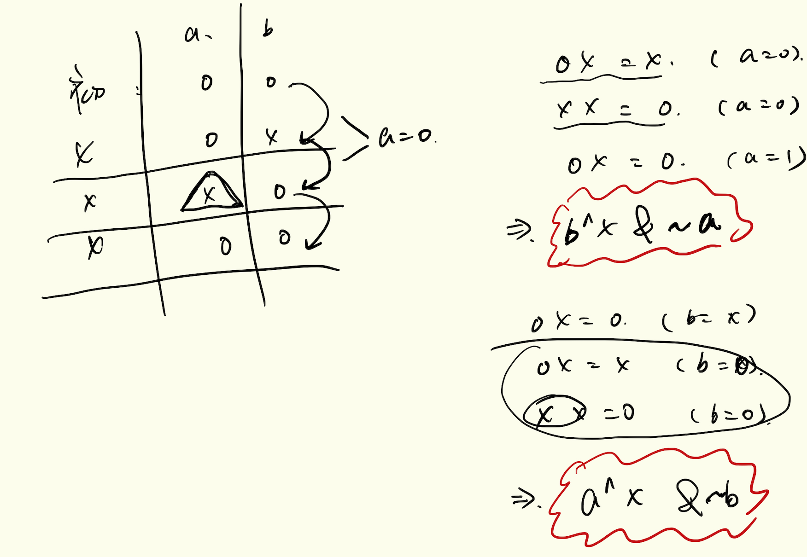

## 最优思路
    如果是出现两次的话，用一个bit就可以
    比如 b，初始为0
    当5第1次出现时， b=5
    当5第2次出现是， b清空为0，表示b可以去处理其他数字了
    所以，最后 如果 b !=0的话，b记录的就是只出现了一次的那个数字
    
    ->公式就是 b = b xor i  或者 b = b^i

    那么，如果是三次的话，香浓定理，需要用2bits进行记录

    当5第一次出现的时候，b = 5, a=0,  b记录这个数字
    当5第二次出现的时候，b = 0, a=5， a记录了这个数字
    当5第三次出现的时候，b = 0, a=0， 都清空了，可以去处理其他数字了
    所以，如果有某个数字出现了1次，就存在b中，出现了两次，就存在a中，所以返回 a|b

    公式方面 ，上面两次的时候，b清空的公式是 b = b xor i
            而第三次时，b要等于零，而这时a是True，所以再 & 一个a的非就可以，b = b xor & ~a
    -> b = b xor i & ~a
       a = a xor i & ~b

## 位运算的性质

### 交换律 
- a|b = b|a
- a&b = b&a
- a^b = b^a

### 结合律
- (a|b)|c = a|(b|c)
- (a&b)&c = a&(b&c)
- (a^b)^c = a^(b^c)

### 分配律(其他类推)
- a&(b|c) = (a&b)|(a&c)
- a^(b|c)=(a^b)|(a^c)

### 其他
- a|0 = a
- a&1 = a
- a&0 = 0

- a^a = 0
- a^0 =a

- a|~a = 1
- a&~a = 0
- a&a = a
- a|a = a

- a|(a&b) = a
- a&(a|b) = a