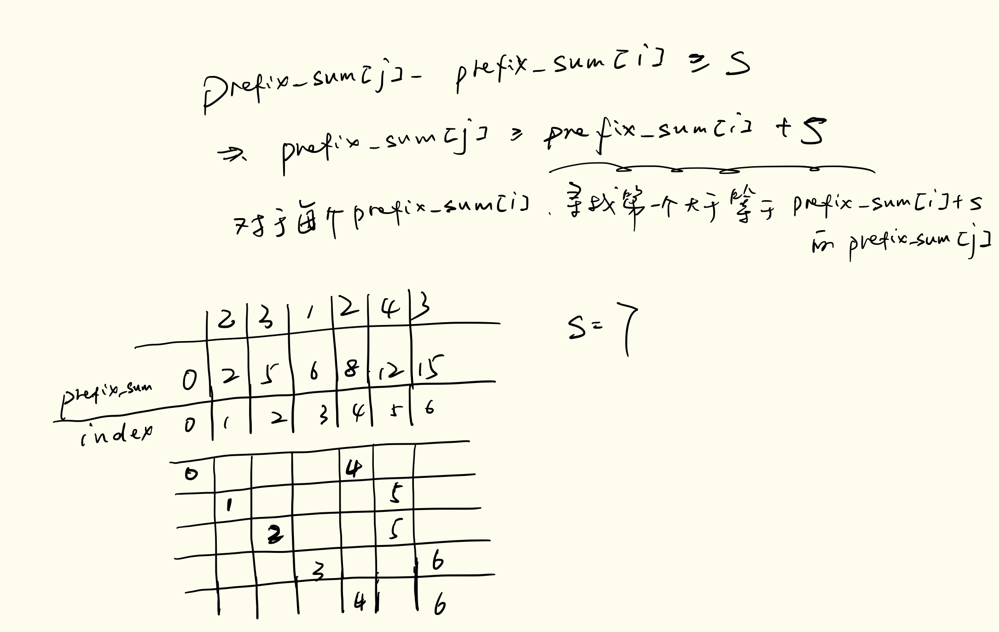

## 思路

### time complexity O(n)
这道题给定了我们一个数字，让我们求子数组之和大于等于给定值的最小长度，跟之前那道 Maximum Subarray 最大子数组有些类似，并且题目中要求我们实现O(n)和O(nlgn)两种解法，那么我们先来看O(n)的解法，我们需要定义两个指针left和right，分别记录子数组的左右的边界位置，然后我们让right向右移，直到子数组和大于等于给定值或者right达到数组末尾，此时我们更新最短距离，并且将left像右移一位，然后再sum中减去移去的值，然后重复上面的步骤，直到right到达末尾，且left到达临界位置，即要么到达边界，要么再往右移动，和就会小于给定值

### time complexity O(nlogn)
